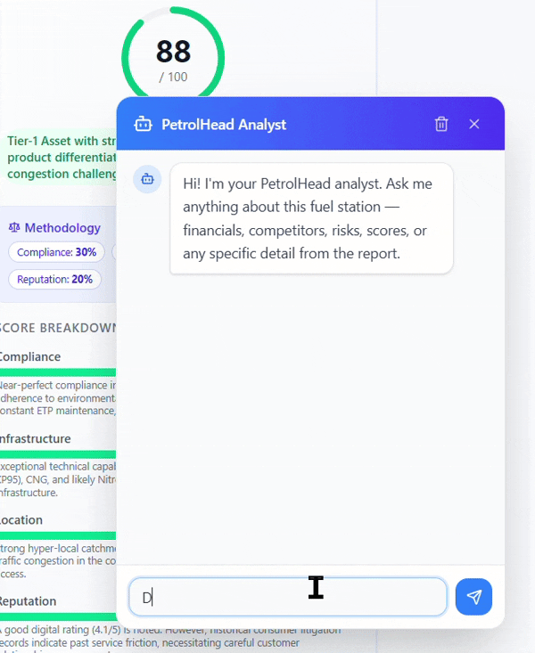

# 🚀 PetrolHead — Fuel Station Intelligence Platform

**AI-powered deep research & forensic intelligence dashboard for fuel station competitive analysis**

[](https://github.com/AyushDhimann/PetrolHead)
[](https://nextjs.org/)
[](https://fastapi.tiangolo.com/)
[](https://www.typescriptlang.org/)
[](https://www.python.org/)

---

## 📋 Table of Contents

- [Overview](#overview)
- [Demos](#demos)
- [Architecture](#architecture)
- [Features](#features)
- [Tech Stack](#tech-stack)
- [Quick Start](#quick-start)
- [Project Structure](#project-structure)
- [Usage](#usage)
- [Research Pipeline](#research-pipeline)
- [API Reference](#api-reference)
- [Dashboard Components](#dashboard-components)
- [Caching](#caching)
- [Advanced](#advanced)

---

## 🎯 Overview

PetrolHead is a full-stack intelligence platform that conducts deep AI research on fuel stations, then transforms the raw text reports into interactive forensic-grade dashboards. Enter a station name (or paste a Google Maps link) and the system will:

1. **Deep Research** — Gemini Deep Research Agent (primary) conducts exhaustive multi-source investigation with real-time progress streaming
2. **Fallback** — Perplexity sonar-deep-research activates automatically if Gemini fails
3. **Extraction** — Frontend extracts structured data from the raw report using 9 parallel Zod-schema server actions powered by Gemini 2.5 Flash Lite
4. **Dashboard** — Interactive 9-card bento grid with forensic-level detail, anomaly detection, and strategic scoring

### What gets extracted:

- **Identity & Litigation** — Station details, key personnel, ownership history, specific legal disputes with plaintiff names
- **Operational Infrastructure** — Fuel types with significance, automation, safety compliance, non-fuel retail
- **Competitive Landscape** — Threat levels, comparative metrics, catchment splits, market saturation
- **Financial Intelligence** — OPEX breakdown, dealer margins, GST turnover, revenue estimates
- **Location Risk** — Seasonal demand drivers, infrastructure risks, binary catalysts, access analysis
- **Customer Sentiment** — Multi-platform ratings, review anomalies, specific quote analysis
- **Strategic Score** — Weighted scoring methodology with drill-down reasoning
- **Payment Methods** — Digital payment adoption, fleet cards, loyalty programs, POS infrastructure
- **Anomalies & Overflow** — Data anomalies, environmental compliance, miscellaneous intel, future outlook

---

## � Demos

### 🌐 Live Demo
**Experience the platform in action:** [https://petrolhead.ayushdhiman.dev/demos](https://petrolhead.ayushdhiman.dev/demos)

### 📹 Visual Walkthroughs

#### Website Demo

> ⚠️ **Note:** This GIF is 17MB and may take a moment to load. Shows the full workflow from research initiation to dashboard exploration.

#### Chat Demo

> Interactive agentic chat interface for real-time query handling and insight discovery.

### 📄 Detailed Demo Guides (PDFs)
Comprehensive walkthroughs with annotated screenshots and step-by-step explanations:

- **[Updated Demo 1: Fuel Station Intelligence](demo_results/Updated%20Demo%201%20Fuel%20Station%20Intelligence.pdf)** — Initial research setup and basic extraction
- **[Updated Demo 2: Fuel Station Intelligence](demo_results/Updated%20Demo%202%20Fuel%20Station%20Intelligence.pdf)** — Advanced dashboard features and filtering
- **[Updated Demo 3: Fuel Station Intelligence](demo_results/Updated%20Demo%203%20Fuel%20Station%20Intelligence.pdf)** — Chat interface and custom queries

---

## �🏗 Architecture

```
User Query / Google Maps URL
        │
        ▼
┌──────────────────┐    Fallback    ┌─────────────────────┐
│  Gemini Deep     │ ────────────► │  Perplexity sonar   │
│  Research Agent  │   (auto)      │  deep-research      │
│  (Method 1)     │                │  (Method 2)         │
└────────┬─────────┘                └──────────┬──────────┘
         │                                     │
         ▼                                     ▼
    Raw Text Report (saved to disk + Supabase)
         │
         ▼
┌────────────────────────────────────────────┐
│  Frontend: 9 parallel Zod + Gemini Flash   │
│  Server Actions (extract.ts)               │
│  ┌─────────┐ ┌─────────┐ ┌──────────┐     │
│  │Identity │ │Opertnl  │ │Competitor│ ... │
│  └─────────┘ └─────────┘ └──────────┘     │
│  File Cache → Supabase Cache → Gemini API  │
└────────────────────────────────────────────┘
         │
         ▼
    9-Card Dashboard + Agentic Chat
```

---

## ✨ Features

### 🧠 Forensic Extraction (9 Sections)
- **Vercel AI SDK** with **Zod** schemas for typed structured extraction
- **Gemini 2.5 Flash Lite** for fast, cost-effective analysis
- **9 parallel server actions** — Identity, Operational, Competitors, Financial, Location, Sentiment, Score, PaymentMethods, Anomalies
- Forensic prompts that capture specific evidence (plaintiff names, exact allegations, seasonal peaks)
- Avoids "smoothing effect" — surfaces raw anomalous data, not summaries

### 🔬 Dual-Provider Research
- **Primary**: Gemini Deep Research Agent (`deep-research-pro-preview-12-2025`) — shown as "Method 1" in dashboard
- **Fallback**: Perplexity `sonar-deep-research` — shown as "Method 2" in dashboard
- Automatic failover with `AUTO_FALLBACK_ENABLED`
- Real-time streaming of research progress and AI thought summaries

### 🗺️ Google Maps URL Support
- Paste a Google Maps link instead of typing a station name
- Auto-detected by the prompt builder
- AI instructed to resolve the URL to the actual station identity before researching

### 💾 Intelligent 3-Layer Caching
1. **File-system cache** — MD5 hash of report text → `.cache/extractions/{section}_{hash}.json`
2. **Supabase cache** — `extraction_cache` table with 30-day TTL per section
3. **API call** — Only when both caches miss
- Console logs `CACHE HIT` / `CACHE MISS` per section for transparency

### 📂 Researches Page
- View all ongoing, completed, and failed research sessions at `/researches`
- Auto-refreshes every 5 seconds for live progress updates
- Merges in-memory sessions with Supabase-persisted past researches
- Direct links to progress page or dashboard

### 🎨 Rich Data Visualization
- **9 interactive pastel-themed cards** in a responsive bento grid layout
- **Litigation profile** with specific cases and source quotes
- **Comparative metrics table** for competitor benchmarking
- **OPEX breakdown** and dealer margin charts
- **Demand drivers timeline** with peak season months
- **Payment methods** with fleet cards and loyalty programs
- **Sentiment analysis** with platform-specific disparities
- **Future outlook timeline** for strategic planning

### 💬 Agentic Chat Widget
- Floating chat panel (bottom-right corner)
- Streaming responses from Gemini with full report context
- Clear history, smooth animations

### ⚡ CLI Runner
- `python -m petrolhead setup` — Install all dependencies
- `python -m petrolhead run` — Start backend (FastAPI) + frontend (Next.js) concurrently
- Cross-platform (Windows, macOS, Linux)
- Graceful shutdown with Ctrl+C

---

## 🛠 Tech Stack

### Backend
| Technology | Purpose |
|---|---|
| **FastAPI** | High-performance async API framework |
| **Python 3.11+** | Core runtime |
| **Google Generative AI** | Gemini Deep Research Agent + Flash extraction |
| **Perplexity API** | Fallback deep research provider |
| **Supabase** | PostgreSQL for sessions, results, logs, extraction cache |
| **Pydantic Settings** | Typed configuration from `.env` |
| **SSE-Starlette** | Server-sent events for real-time streaming |
| **Uvicorn** | ASGI server |

### Frontend
| Technology | Purpose |
|---|---|
| **Next.js 16.1.6** | React meta-framework with server actions |
| **React 19.2.3** | UI library |
| **TypeScript** | Type safety |
| **Tailwind CSS v4** | Utility-first styling |
| **Vercel AI SDK v6** | `generateObject()` for typed LLM extraction |
| **Zod** | 9 forensic extraction schemas |
| **Framer Motion** | Animations |
| **Lucide React** | Icon set |
| **Recharts** | Data visualization |

### Infrastructure
| Component | Port |
|---|---|
| Backend API | `6055` |
| Frontend dev server | `5055` |
| API docs (Swagger) | `6055/docs` |

---

## 🚀 Quick Start

### Prerequisites
- Python 3.11+
- Node.js 18+
- npm (comes with Node.js)
- Git

### Step 1: Clone Repository

```bash
git clone https://github.com/AyushDhimann/PetrolHead.git
cd PetrolHead
```

### Step 2: Run Automated Setup

The setup wizard will:
- Create Python virtual environment
- Install backend dependencies (from `requirements.txt`)
- Install frontend dependencies (npm packages)
- Prompt you for API credentials
- Create `.env` and `.env.local` files automatically
- Create output directories

```bash
python -m petrolhead setup
```

You'll be prompted to enter:
- **GEMINI_API_KEY** (required) — Get from [Google AI Studio](https://aistudio.google.com/apikey)
- **PERPLEXITY_API_KEY** (optional) — Get from [Perplexity API](https://www.perplexity.ai/api)
- **SUPABASE_URL** (optional) — Project URL from [Supabase](https://supabase.com/dashboard)
- **SUPABASE_KEY** (optional) — Anon key from Supabase

### Step 3: (Optional) Configure Supabase

If you're using Supabase for persistent data storage:

1. Create a new Supabase project at [supabase.com](https://supabase.com)
2. Go to SQL Editor → New Query
3. Copy & paste the SQL from `backend/database.sql`
4. Execute the query to create tables
5. Copy your project URL and anon key to `backend/.env`:
   ```env
   SUPABASE_ENABLED=true
   SUPABASE_URL=your_project_url
   SUPABASE_KEY=your_anon_key
   ```

### Step 4: Start the Application

```bash
python -m petrolhead run
```

This starts:
- **Backend** (FastAPI): http://localhost:6055
- **Frontend** (Next.js): http://localhost:5055
- **API Docs** (Swagger): http://localhost:6055/docs

### Manual Environment Setup (Alternative)

If you prefer manual setup, the wizard creates these files:

**`backend/.env`** — Copy from `backend/.env.example` and fill in your keys:
```env
GEMINI_API_KEY=your_google_api_key_here
PERPLEXITY_API_KEY=your_perplexity_key_here
SUPABASE_URL=your_supabase_url
SUPABASE_KEY=your_supabase_anon_key
SUPABASE_ENABLED=false
DEMO_MODE_ENABLED=true
PRIMARY_PROVIDER=gemini
FALLBACK_PROVIDER=perplexity
AUTO_FALLBACK_ENABLED=true
```

**`frontend/.env.local`**:
```env
NEXT_PUBLIC_API_URL=http://localhost:6055
GOOGLE_GENERATIVE_AI_API_KEY=your_google_api_key_here
```

---

## 📁 Project Structure

```
PetrolHead/
├── backend/                           # FastAPI backend
│   ├── main.py                       # App entry + router registration
│   ├── requirements.txt               # Python dependencies
│   ├── database.sql                  # Supabase schema (sessions, results, logs, extraction_cache)
│   ├── config/
│   │   ├── settings.py               # Pydantic Settings (all config from .env)
│   │   └── logging_config.py         # Logging setup
│   ├── features/
│   │   ├── research/                 # Deep research pipeline
│   │   │   ├── service.py            # Orchestrator with provider fallback
│   │   │   ├── router.py             # /api/research/* endpoints + SSE streaming
│   │   │   ├── gemini_client.py      # Gemini Deep Research Agent client
│   │   │   ├── perplexity_client.py  # Perplexity sonar-deep-research client
│   │   │   └── models.py            # Research status, result models
│   │   ├── converter/                # Text→JSON conversion (currently disabled)
│   │   ├── dashboard/                # Dashboard + past-researches endpoints
│   │   ├── session/                  # In-memory session store + session API
│   │   ├── cache/                    # Supabase extraction cache API
│   │   └── supabase/                 # Supabase client + CRUD service
│   ├── utils/
│   │   ├── prompt_builder.py         # Prompt template builder + Google Maps URL detection
│   │   └── file_manager.py           # Research output file management
│   ├── prompts/
│   │   ├── User Prompts/prompt.txt   # 12-phase research mandate template
│   │   └── System Prompts/           # Perplexity system prompt
│   └── demo_outputs/                 # Pre-built demo reports (DO1-DO3)
│
├── frontend/                          # Next.js frontend
│   ├── src/
│   │   ├── app/
│   │   │   ├── page.tsx              # Home — search bar to start research
│   │   │   ├── layout.tsx            # Root layout with nav (Home/Demos/Researches)
│   │   │   ├── demos/page.tsx        # Demo listing page
│   │   │   ├── demo/[id]/page.tsx    # Demo dashboard (9 cards)
│   │   │   ├── research/
│   │   │   │   └── [sessionId]/
│   │   │   │       ├── page.tsx      # Live research progress with SSE streaming
│   │   │   │       └── dashboard/
│   │   │   │           └── page.tsx  # Live research dashboard (9 cards + Method badge)
│   │   │   ├── researches/page.tsx   # All researches — ongoing/completed/failed
│   │   │   └── api/chat/             # Chat API route (Gemini streaming)
│   │   ├── schemas/
│   │   │   └── dashboard.ts          # 9 Zod schemas (forensic extraction)
│   │   ├── actions/
│   │   │   └── extract.ts            # Server actions + 3-layer caching
│   │   ├── components/dashboard/
│   │   │   ├── IdentityCard.tsx
│   │   │   ├── OperationalCard.tsx    # CNG auto-normalization
│   │   │   ├── CompetitorCard.tsx
│   │   │   ├── FinancialCard.tsx
│   │   │   ├── LocationCard.tsx       # Seasonal demand drivers
│   │   │   ├── SentimentCard.tsx
│   │   │   ├── ScoreCard.tsx
│   │   │   ├── PaymentMethodsCard.tsx # Payment methods, fleet cards, loyalty
│   │   │   ├── AnomaliesCard.tsx
│   │   │   ├── ChatWidget.tsx
│   │   │   └── Skeletons.tsx          # 9 loading skeletons
│   │   └── lib/
│   │       ├── api.ts                # Backend API client
│   │       ├── cookies.ts            # Session cookie helpers
│   │       └── dashboard-utils.ts    # Dashboard utilities
│   └── .cache/extractions/           # File-system extraction cache
│
├── petrolhead/                       # CLI package
│   ├── __main__.py                   # Entry: `python -m petrolhead`
│   ├── run.py                        # Concurrent backend + frontend runner
│   └── setup.py                      # Dependency installer
│
├── README.md                         # This file
├── PLANNING.md                       # Architecture planning notes
└── LICENSE
```

---

## 🎮 Usage

### Live Research

1. **Start the stack:** `python -m petrolhead run`
2. **Open http://localhost:5055**
3. **Enter a station name** or **paste a Google Maps link**
4. **Watch live progress** — real-time streaming of AI thought process
5. **Dashboard loads** automatically when research completes — 9 forensic cards

### Demo Mode

1. Navigate to **Demos** (nav bar)
2. Click a demo card (DO1, DO2, or DO3)
3. Dashboard loads with pre-built reports — instant extraction

### Researches Page

1. Navigate to **Researches** (nav bar)
2. View all sessions — ongoing (live progress), completed (click to dashboard), failed
3. Auto-refreshes every 5 seconds

---

## 🔬 Research Pipeline

### Provider Configuration

| Setting | Default | Description |
|---|---|---|
| `PRIMARY_PROVIDER` | `gemini` | First provider attempted (shown as "Method 1") |
| `FALLBACK_PROVIDER` | `perplexity` | Automatic fallback (shown as "Method 2") |
| `AUTO_FALLBACK_ENABLED` | `true` | Whether to auto-switch on primary failure |
| `CONVERTER_ENABLED` | `false` | Backend text→JSON conversion (disabled; frontend handles extraction) |

### Flow

1. User enters query → `prompt_builder.py` inserts it into the 12-phase research template
2. If query is a Google Maps URL → extra resolution instructions are injected
3. Primary provider (Gemini Deep Research Agent) streams progress + thought summaries via SSE
4. On failure → auto-fallback to Perplexity sonar-deep-research
5. Raw text report saved to `outputs/research/` and Supabase `research_results`
6. Frontend navigates to dashboard → 9 parallel `extractSection()` calls with Zod schemas
7. Each extraction checks: file cache → Supabase cache → Gemini Flash Lite API

---

## 🔌 API Reference

### Research
| Method | Endpoint | Description |
|---|---|---|
| `POST` | `/api/research/start` | Start a new research session |
| `GET` | `/api/research/stream/{session_id}` | SSE stream of progress + thoughts |

### Session
| Method | Endpoint | Description |
|---|---|---|
| `GET` | `/api/session/{session_id}` | Get session status + progress |
| `GET` | `/api/session/{session_id}/result` | Get research result (raw text + metadata) |
| `GET` | `/api/session/list` | List all in-memory sessions |

### Dashboard
| Method | Endpoint | Description |
|---|---|---|
| `GET` | `/api/dashboard/demos` | List available demos |
| `GET` | `/api/dashboard/demo/{id}` | Get demo data |
| `GET` | `/api/dashboard/live/{session_id}` | Get live dashboard data |
| `GET` | `/api/dashboard/past-researches` | List past researches from Supabase |

### Cache
| Method | Endpoint | Description |
|---|---|---|
| `GET` | `/api/cache/get/{cache_key}` | Get cached extraction |
| `POST` | `/api/cache/set` | Store extraction in Supabase cache |

### Other
| Method | Endpoint | Description |
|---|---|---|
| `GET` | `/api/health` | Health check + config info |
| `POST` | `/api/chat` | Streaming chat (frontend route) |

---

## 🎨 Dashboard Components (9 Cards)

| # | Card | Color Theme | Key Forensic Fields |
|---|---|---|---|
| 1 | **IdentityCard** | Rose | `keyPersonnel`, `litigationProfile.specificCases[]`, `ownershipHistory` |
| 2 | **OperationalCard** | Emerald | `fuelTypes[].significance`, `nonFuelRetail[]`, `safetyCompliance[]` — CNG auto-detected from name |
| 3 | **CompetitorCard** | Amber | `competitors[].threatLevel`, `catchmentSplit`, `comparativeTable[]` |
| 4 | **FinancialCard** | Indigo | `opexBreakdown[]`, `dealerMargins[]`, `gstTurnoverCategory` |
| 5 | **LocationCard** | Cyan | `demandDrivers[]{peakMonths[], impactType}`, `infrastructureRisks[].isBinaryRisk` |
| 6 | **SentimentCard** | Orange | `platformBreakdown[]`, `notableReviews[]{quote, sentiment}` |
| 7 | **ScoreCard** | Yellow | `scoringMethodology[]`, `subscores[]{reasoning}` |
| 8 | **PaymentMethodsCard** | Violet | `acceptedMethods[]`, `fleetCards[]`, `loyaltyPrograms[]`, `posInfrastructure` |
| 9 | **AnomaliesCard** | Red/Gray | `dataAnomalies[]`, `environmentalCompliance`, `miscIntel[]`, `futureOutlook[]` |

---

## 💾 Caching

### 3-Layer Cache Hierarchy

```
Request → File cache (.cache/extractions/{section}_{hash}.json)
    ↓ MISS
  Supabase cache (extraction_cache table, 30-day TTL)
    ↓ MISS
  Gemini 2.5 Flash Lite API call
    ↓ RESULT
  Write to both file cache + Supabase cache
```

### Cache Key Format
- `{section}_{md5_hash_first_12_chars}` — e.g., `identity_abc123def456`

### Supabase extraction_cache Schema
```sql
CREATE TABLE extraction_cache (
  id UUID PRIMARY KEY DEFAULT gen_random_uuid(),
  cache_key TEXT NOT NULL UNIQUE,
  section TEXT NOT NULL,
  text_hash TEXT NOT NULL,
  extracted_data JSONB NOT NULL,
  created_at TIMESTAMPTZ DEFAULT now(),
  expires_at TIMESTAMPTZ DEFAULT (now() + INTERVAL '30 days')
);
```

---

## 🎯 Advanced

### Troubleshooting Setup

**Issue: `python -m petrolhead` command not found**
- Ensure you're in the project root directory
- Verify `. .venv/Scripts/activate` (Windows) or `source .venv/bin/activate` (macOS/Linux)

**Issue: Missing API keys**
- Edit `backend/.env` and `frontend/.env.local` manually
- Copy from `.env.example` and fill in your credentials
- Restart the application with `python -m petrolhead run`

**Issue: Port 6055 or 5055 already in use**
- Change port in `petrolhead/run.py` or kill existing processes

### Running Backend Only

```bash
# Activate venv first
source .venv/bin/activate  # macOS/Linux
# or
.venv\Scripts\activate  # Windows

cd backend
python -m uvicorn main:app --host 0.0.0.0 --port 6055 --reload
```

### Running Frontend Only

```bash
cd frontend
npm run dev
```

### Manual Dependency Installation

```bash
# Backend
pip install -r backend/requirements.txt

# Frontend
cd frontend
npm install
```

### Resetting Setup

To reset everything and start fresh:

```bash
# Remove venv
rm -rf .venv  # macOS/Linux
rmdir /s .venv  # Windows (PowerShell)

# Remove node_modules
rm -rf frontend/node_modules  # macOS/Linux
rmdir /s frontend\node_modules  # Windows

# Remove env files (keep backups!)
rm backend/.env frontend/.env.local  # macOS/Linux

# Rerun setup
python -m petrolhead setup
```

### Environment Variables

**Backend** (`backend/.env`):
| Variable | Required | Description |
|---|---|---|
| `GEMINI_API_KEY` | Yes | Google Generative AI key |
| `PERPLEXITY_API_KEY` | No | Perplexity key (for fallback) |
| `SUPABASE_URL` | No | Supabase project URL |
| `SUPABASE_KEY` | No | Supabase anon key |
| `SUPABASE_ENABLED` | No | Enable Supabase persistence (default: false) |
| `PRIMARY_PROVIDER` | No | Primary LLM provider (default: gemini) |
| `FALLBACK_PROVIDER` | No | Fallback provider (default: perplexity) |
| `AUTO_FALLBACK_ENABLED` | No | Auto-switch on failure (default: true) |
| `DEMO_MODE_ENABLED` | No | Enable demo endpoints (default: true) |
| `CORS_ORIGINS` | No | Allowed CORS origins (default: http://localhost:5055) |

**Frontend** (`frontend/.env.local`):
| Variable | Required | Description |
|---|---|---|
| `NEXT_PUBLIC_API_URL` | No | Backend URL (default: http://localhost:6055) |
| `GOOGLE_GENERATIVE_AI_API_KEY` | Yes | For Vercel AI SDK extraction |

### Building for Production

```bash
# Frontend
cd frontend
npm run build
npm start

# Backend
cd backend
python -m uvicorn main:app --host 0.0.0.0 --port 6055
```

### Adding a New Dashboard Card

1. **Create Zod schema** in `frontend/src/schemas/dashboard.ts`
2. **Create extraction function** in `frontend/src/actions/extract.ts`
3. **Create skeleton loader** in `frontend/src/components/dashboard/Skeletons.tsx`
4. **Create card component** in `frontend/src/components/dashboard/YourCard.tsx`
5. **Wire into pages** — `demo/[id]/page.tsx` and `research/[sessionId]/dashboard/page.tsx`

---

## 📊 Demo Reports

3 pre-built reports in `backend/demo_outputs/PlainTexts/`:

| Demo | Station | Brand | Location |
|---|---|---|---|
| DO1 | Sher Service Station | IndianOil | Janakpuri, Delhi |
| DO2 | Jay Garud Gas Station | IndianOil | Janakpuri, Delhi |
| DO3 | Jai Shree Ganesh Filling Station | BPCL | NH-44, Delhi |

---

## 📄 License

See [LICENSE](LICENSE) file.

---

**Built with Next.js, FastAPI, Gemini AI, and Supabase**
